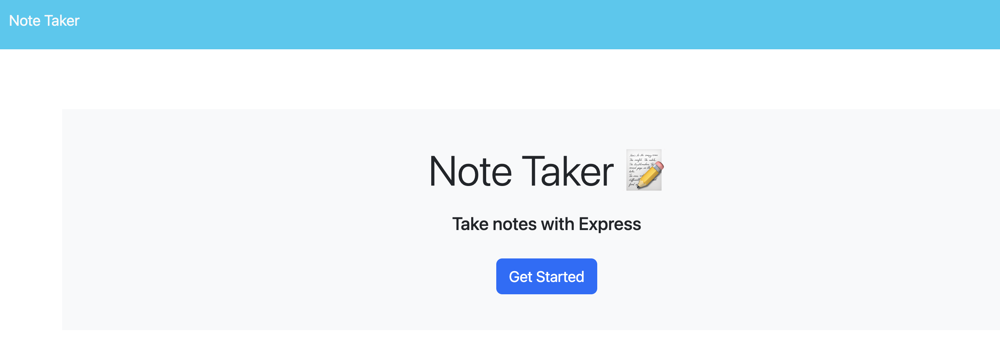
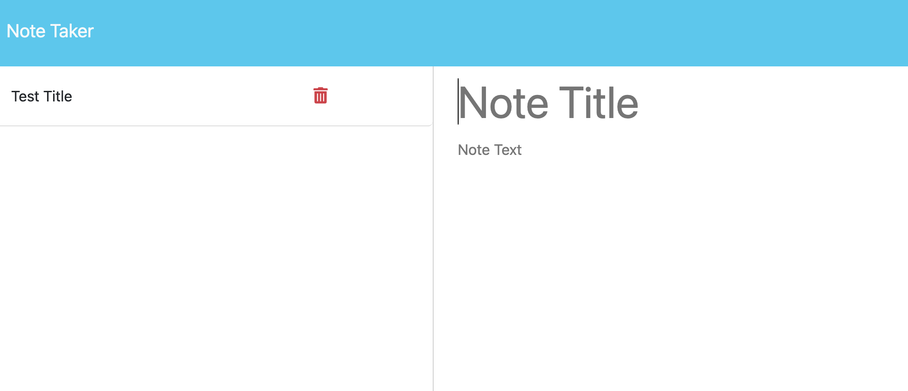

# NOTE-TAKER

  ## Table of Contents
- [Description](#description) 
- [Installation](#installation)
- [Usage](#usage)
- [Contributing](#contributing)
- [Test](#test)
- [Contact](#contact)
 

  ## Description

  The purpose of this project is to create an server.js file with the already given code.  The app allows you to create a note and it should appear on the left pane and you could continue to add new notes.

  

  

  
  ## Installation

  Website: https://note-taker-cmv3.onrender.com

  To install, clone Github repository and install on local machine.

  ## Usage

  For usage, node.js must be installed, along with the express package and uuid.

  ## Contributing
  Jorge Guzman

  ## Test
  Various test were ran using Insomnia.
  
  ## Contact
  Email: jguzman913@gmail.com

  Github: https://github.com/JGuzman87/